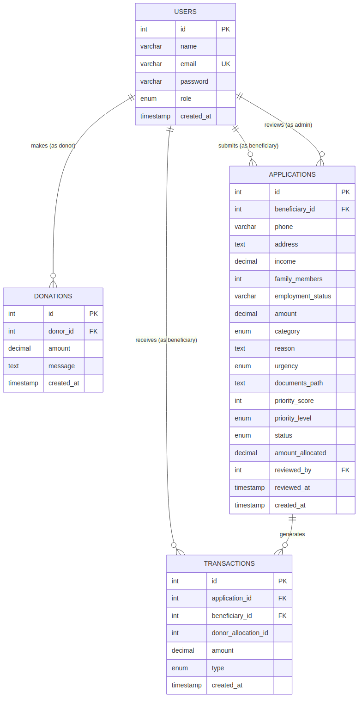
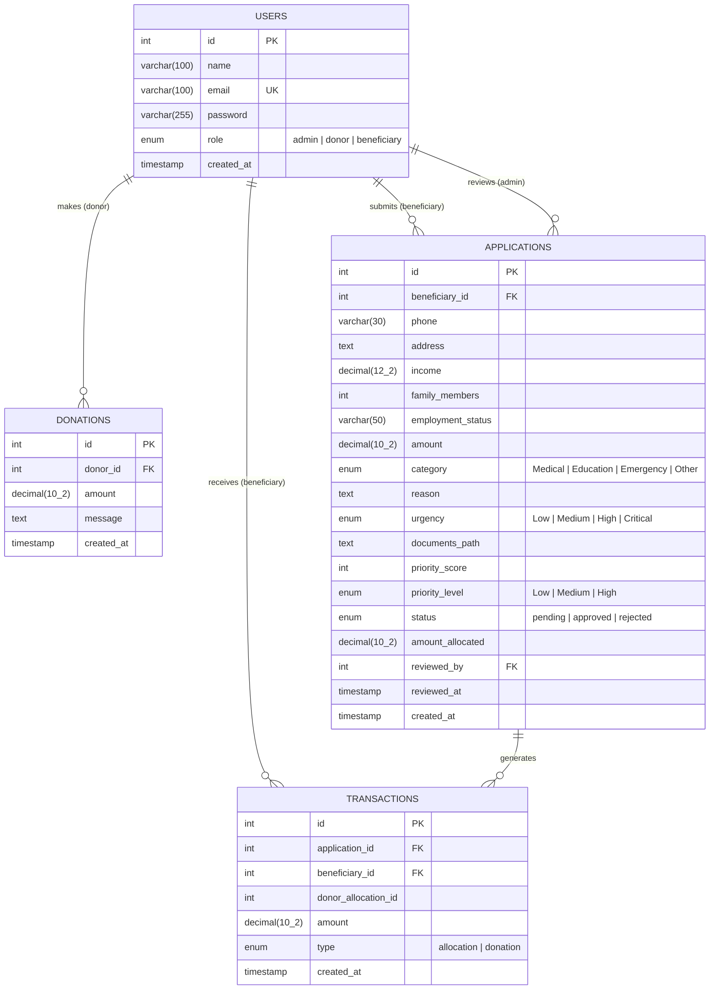

# Entity-Relationship Diagram

## Financial Resource Management System for Social Welfare

## Relationships

| Relationship | Cardinality | Description |
|---|---|---|
| `USERS` → `DONATIONS` | One-to-Many | A donor (user) can make many donations |
| `USERS` → `APPLICATIONS` (beneficiary) | One-to-Many | A beneficiary can submit many applications |
| `USERS` → `APPLICATIONS` (reviewer) | One-to-Many | An admin can review many applications |
| `USERS` → `TRANSACTIONS` | One-to-Many | A beneficiary can receive many fund allocations |
| `APPLICATIONS` → `TRANSACTIONS` | One-to-Many | An approved application generates a transaction |

## Tables Overview

### `users`
Central table for all system actors. The `role` field distinguishes between **admin**, **donor**, and **beneficiary**.

### `donations`
Records every monetary contribution made by a donor. Links back to `users` via `donor_id`. Used to compute the total available fund pool.

### `applications`
The most complex entity — a beneficiary's request for financial assistance. Stores household and income data used to compute a **server-side priority score** (0–100):
- **Income score**: < $10k → +30 | < $20k → +20 | < $30k → +10
- **Family size score**: > 5 members → +20 | > 3 members → +10
- **Urgency score**: Critical → +30 | High → +20 | Medium → +10 | Low → +5
- **Document bonus**: uploaded docs → +20

### `transactions`
Immutable audit log for all fund movements:
- **`allocation`** type: created when an admin approves an application (funds disbursed to beneficiary)
- **`donation`** type: recorded when a donor contributes (funds added to pool)

`available_funds = SUM(donations) − SUM(allocations)`
