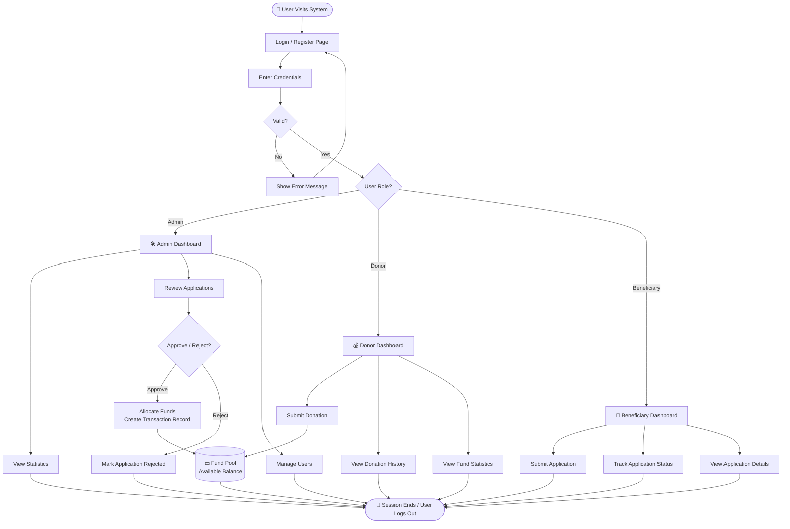

# Flow Diagram

## Financial Resource Management System for Social Welfare  d
---

## 1. Overall System Flow

```mermaid
flowchart TD
    User([👤 User Visits System]) --> Login[Login / Register Page]
    Login --> Creds[Enter Credentials]
    Creds --> Verify{Valid?}
    Verify -- No --> ErrMsg[Show Error Message]
    ErrMsg --> Login
    Verify -- Yes --> Role{User Role?}

    Role -- Admin --> AdminDash[🛠️ Admin Dashboard]
    Role -- Donor --> DonorDash[💰 Donor Dashboard]
    Role -- Beneficiary --> BenefDash[📄 Beneficiary Dashboard]

    AdminDash --> A1[View Statistics]
    AdminDash --> A2[Review Applications]
    AdminDash --> A3[Manage Users]

    DonorDash --> D1[Submit Donation]
    DonorDash --> D2[View Donation History]
    DonorDash --> D3[View Fund Statistics]

    BenefDash --> B1[Submit Application]
    BenefDash --> B2[Track Application Status]
    BenefDash --> B3[View Application Details]

    A2 --> Approve{Approve / Reject?}
    Approve -- Approve --> AllocFunds[Allocate Funds\nCreate Transaction Record]
    Approve -- Reject --> RejectApp[Mark Application Rejected]

    D1 --> FundPool[(💵 Fund Pool\nAvailable Balance)]
    AllocFunds --> FundPool

    A1 --> End([🏁 Session Ends / User Logs Out])
    A3 --> End
    D2 --> End
    D3 --> End
    B1 --> End
    B2 --> End
    B3 --> End
    FundPool --> End
    RejectApp --> End
```

---

\
