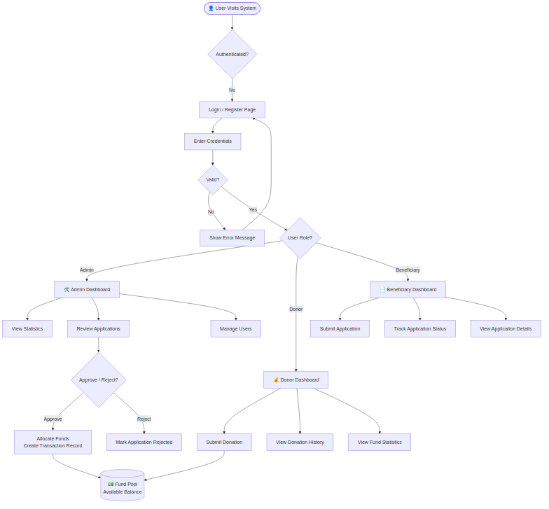
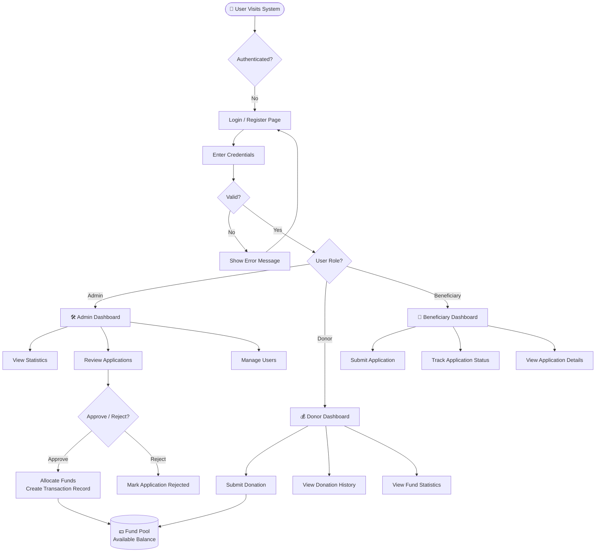
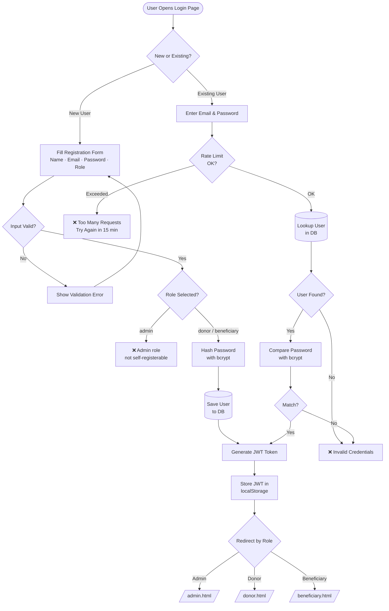
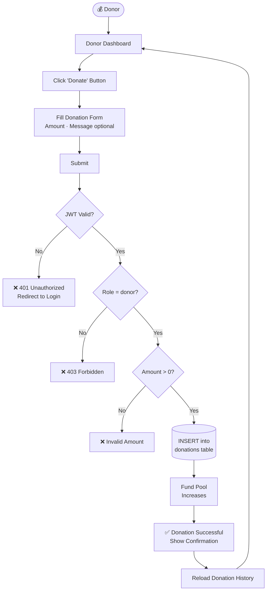
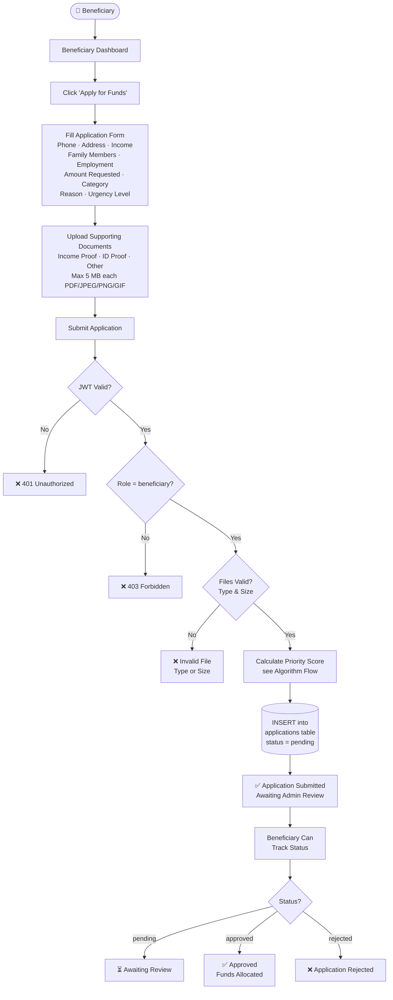
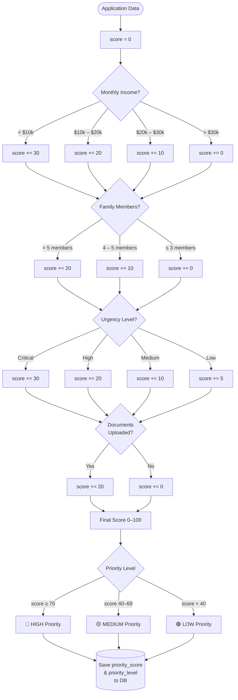
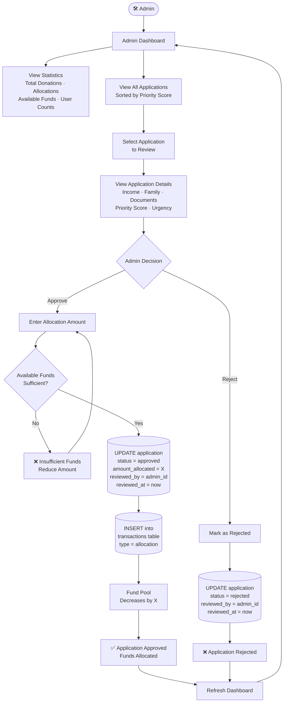
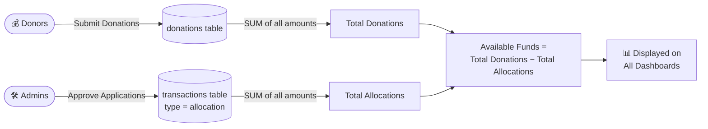
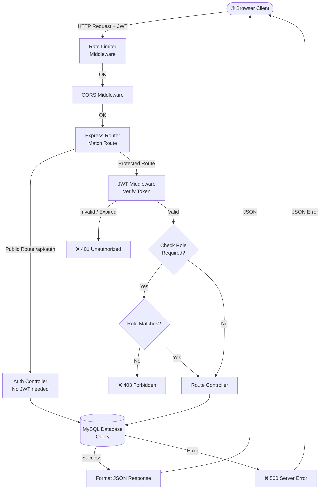

# Flow Diagram

## Financial Resource Management System for Social Welfare

---

## 1. Overall System Flow

---

## 2. User Registration & Authentication Flow

---

## 3. Donation Submission Flow

---

## 4. Beneficiary Application Submission Flow

---

## 5. Priority Scoring Algorithm Flow

---

## 6. Admin Review & Fund Allocation Flow

---

## 7. Fund Pool Calculation Flow

---

## 8. API Request–Response Flow

