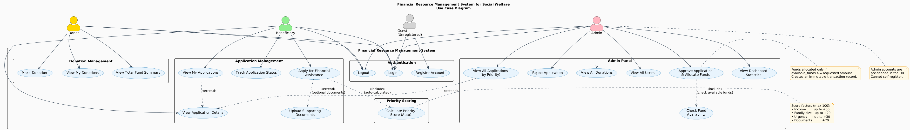
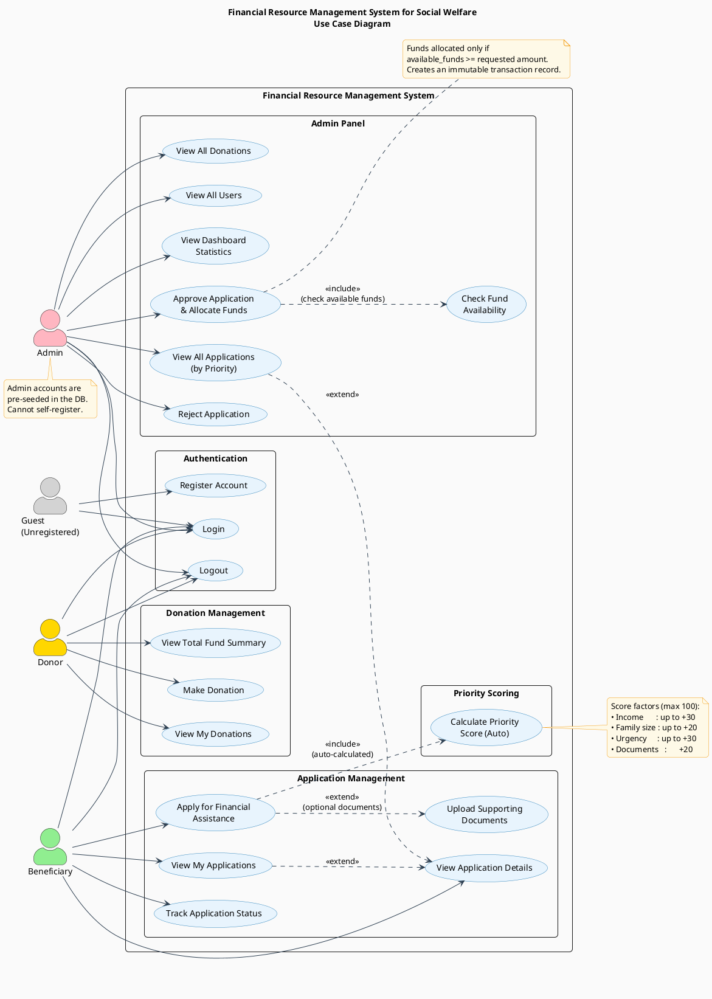

# Use Case Diagram

## Financial Resource Management System for Social Welfare

---

## Actors

| Actor | Description |
|---|---|
| **Guest (Unregistered)** | Any visitor who has not yet logged in. Can only register or log in. |
| **Donor** | Authenticated user who contributes funds to the welfare pool. |
| **Beneficiary** | Authenticated user who applies for and receives financial assistance. |
| **Admin** | Platform administrator who reviews applications and manages the system. Admin accounts are pre-seeded; they cannot self-register. |

---

## Use Cases by Module

### Authentication
| Use Case | Actors | Description |
|---|---|---|
| Register Account | Guest | Create a new account with role `donor` or `beneficiary`. |
| Login | Guest, Donor, Beneficiary, Admin | Authenticate and receive a signed JWT (24 h expiry). |
| Logout | Donor, Beneficiary, Admin | Invalidate the session on the client side. |

### Donation Management
| Use Case | Actor | Description |
|---|---|---|
| Make Donation | Donor | Submit a monetary contribution (amount + optional message) to the welfare fund pool. |
| View My Donations | Donor | List all past donations made by the logged-in donor. |
| View Total Fund Summary | Donor | See `total_donated`, `total_allocated`, and `available_funds`. |

### Application Management
| Use Case | Actor | Description |
|---|---|---|
| Apply for Financial Assistance | Beneficiary | Submit an application with income, family size, urgency, category, and requested amount. |
| Upload Supporting Documents | Beneficiary | Attach income proof, ID proof, and supporting docs to the application *(extends Apply)*. |
| View My Applications | Beneficiary | List all applications submitted by the logged-in beneficiary. |
| Track Application Status | Beneficiary | See whether an application is `pending`, `approved`, or `rejected`. |
| View Application Details | Beneficiary, Admin | Retrieve full details of a single application including reviewer info. |

### Priority Scoring *(automated)*
| Use Case | Trigger | Description |
|---|---|---|
| Calculate Priority Score (Auto) | Included in *Apply for Financial Assistance* | Server calculates a score (0–100) based on income, family size, urgency, and document upload. Users cannot influence this calculation directly. |

**Score breakdown:**

| Factor | Condition | Points |
|---|---|---|
| Income | < $10,000 / yr | +30 |
| Income | $10,000–$19,999 | +20 |
| Income | $20,000–$29,999 | +10 |
| Family size | > 5 members | +20 |
| Family size | > 3 members | +10 |
| Urgency | Critical | +30 |
| Urgency | High | +20 |
| Urgency | Medium | +10 |
| Urgency | Low | +5 |
| Documents | At least one uploaded | +20 |

### Admin Panel
| Use Case | Actor | Description |
|---|---|---|
| View Dashboard Statistics | Admin | Overview metrics: total users, donations, applications, funds allocated, and available balance. |
| View All Applications (by Priority) | Admin | List all applications sorted by priority score (highest first). |
| Approve Application & Allocate Funds | Admin | Mark application as `approved`, deduct from fund pool, and create a transaction record. Includes *Check Fund Availability*. |
| Reject Application | Admin | Mark application as `rejected` without allocating funds. |
| View All Donations | Admin | List all donations from all donors with donor details. |
| View All Users | Admin | List all registered users (passwords excluded). |
| Check Fund Availability | System | Included in *Approve Application* — verifies `available_funds >= requested amount` before approving. |

---

## Relationships

| Relationship | Type | Description |
|---|---|---|
| Apply → Upload Documents | `<<extend>>` | Documents are optional; uploading extends the base application flow. |
| Apply → Calculate Priority Score | `<<include>>` | Priority score is always calculated automatically when an application is submitted. |
| Approve Application → Check Fund Availability | `<<include>>` | Fund check is always performed before approval. |
| View My Applications → View Application Details | `<<extend>>` | Beneficiary can drill into a specific application. |
| View All Applications → View Application Details | `<<extend>>` | Admin can drill into a specific application. |
